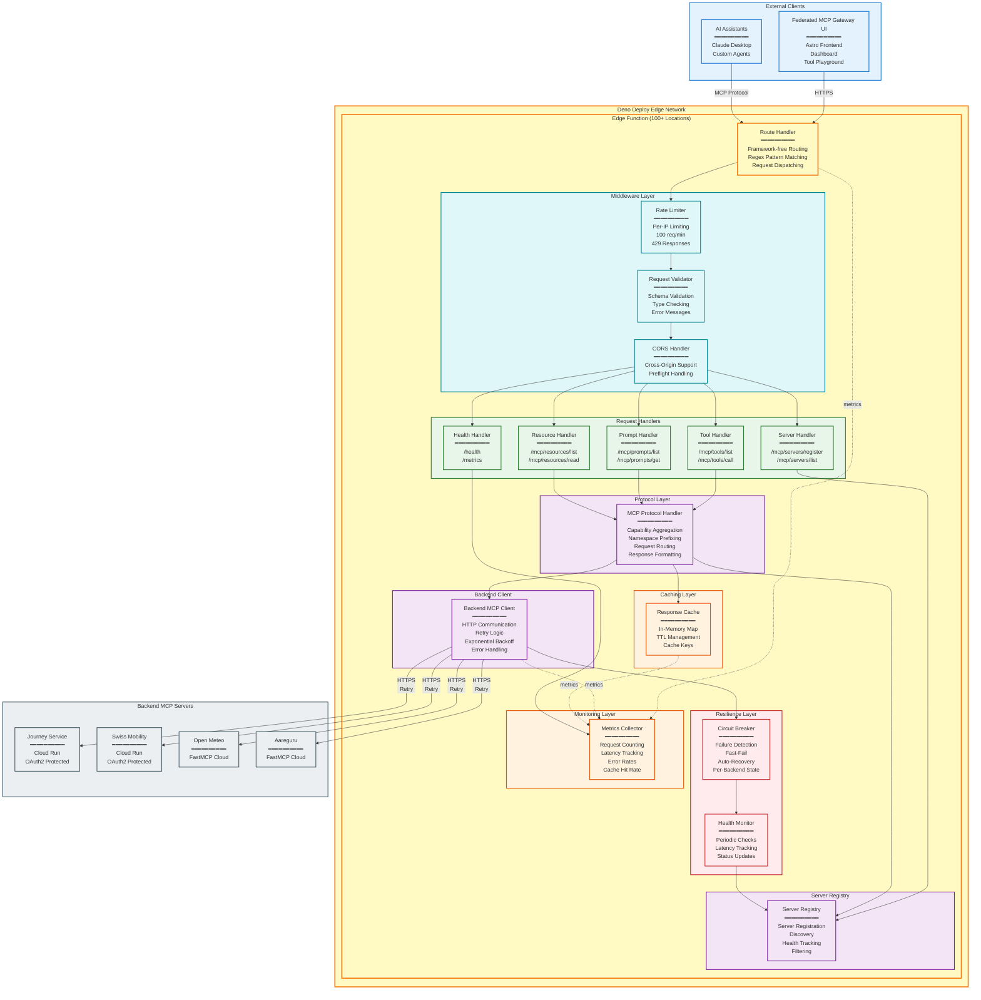
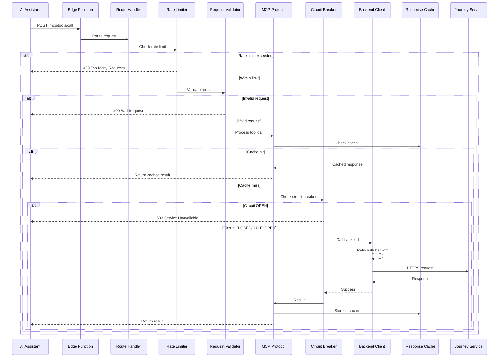

# Deno Federated MCP Gateway - Component Diagram

This document provides a detailed component diagram for the Deno Federated MCP Gateway architecture.

## System Components



## Component Details

### Route Handler

Framework-free request routing with minimal overhead:

**Features:**
- Regex-based pattern matching
- Zero framework dependencies
- Tree-shakeable for bundle optimization
- Full control over request/response

**Route Table:**

```typescript
interface Route {
  method: string;
  path: RegExp;
  handler: (context: RouteContext) => Promise<Response>;
}

const routes: Route[] = [
  { method: 'GET', path: /^\/mcp\/tools\/list$/, handler: listTools },
  { method: 'POST', path: /^\/mcp\/tools\/call$/, handler: callTool },
  { method: 'GET', path: /^\/mcp\/prompts\/list$/, handler: listPrompts },
  { method: 'GET', path: /^\/mcp\/resources\/list$/, handler: listResources },
  { method: 'POST', path: /^\/mcp\/servers\/register$/, handler: registerServer },
  { method: 'GET', path: /^\/health$/, handler: healthCheck },
  { method: 'GET', path: /^\/metrics$/, handler: getMetrics },
];
```

### Request Handlers

#### Tool Handler
- **GET /mcp/tools/list**: Aggregate tools from all registered servers
- **POST /mcp/tools/call**: Execute a tool on the appropriate backend

#### Prompt Handler
- **GET /mcp/prompts/list**: Aggregate prompts from all registered servers
- **POST /mcp/prompts/get**: Retrieve a prompt from a backend

#### Resource Handler
- **GET /mcp/resources/list**: Aggregate resources from all registered servers
- **POST /mcp/resources/read**: Read a resource from a backend

#### Server Handler
- **POST /mcp/servers/register**: Register a new backend server
- **GET /mcp/servers/list**: List all registered servers

#### Health Handler
- **GET /health**: Gateway health status
- **GET /metrics**: Real-time metrics and statistics

### MCP Protocol Handler

Core protocol logic and capability aggregation:

**Responsibilities:**
- Aggregate capabilities from all registered servers
- Add namespace prefixes to tools/prompts (e.g., `journey__find_trips`)
- Route requests to appropriate backend
- Strip namespaces before backend calls

**Namespace Format:** `{server-id}__{tool-name}`

**Examples:**
- `journey__find_trips`
- `mobility__get_trip_pricing`
- `aareguru__get_current_temperature`

### Backend MCP Client

HTTP communication with backend MCP servers:

**Features:**
- Reactive HTTP client using `fetch` API
- Retry logic with exponential backoff (3 attempts)
- Error handling and recovery
- Health checking

**Retry Strategy:**
```typescript
Attempt 1: 100ms delay
Attempt 2: 200ms delay
Attempt 3: 400ms delay
```

### Server Registry

Server registration, discovery, and health tracking:

**Data Model:**

```typescript
interface ServerRegistration {
  id: string;              // Unique server ID
  name: string;            // Display name
  endpoint: string;        // Backend URL
  health: ServerHealth;
  registeredAt?: Date;
}

interface ServerHealth {
  status: 'HEALTHY' | 'DEGRADED' | 'DOWN';
  lastCheck: Date;
  latency: number;         // milliseconds
  errorMessage?: string;
}
```

**Operations:**
- Register/unregister servers
- List all servers
- Filter healthy servers
- Resolve servers by tool/resource/prompt name
- Update server health status

### Middleware Layer

#### Rate Limiter

Per-IP rate limiting to prevent abuse:

**Configuration:**
- Window: 60 seconds
- Max requests: 100 per minute
- Response: 429 Too Many Requests with `Retry-After` header

#### Request Validator

Schema validation for incoming requests:

**Validations:**
- Tool call schema validation
- Resource read validation
- Prompt get validation
- Tool name format validation (namespace__toolname)
- URI validation for resources

#### CORS Handler

Cross-origin resource sharing support:

**Features:**
- Preflight request handling
- Configurable allowed origins
- Credentials support
- Custom headers support

### Resilience Layer

#### Circuit Breaker

Prevent cascading failures and enable automatic recovery:

**States:**
- **CLOSED**: Normal operation, all requests pass through
- **OPEN**: Service failing, rejects requests immediately (fail-fast)
- **HALF_OPEN**: Recovery mode, testing if service has stabilized

**Configuration:**
```typescript
{
  failureThreshold: 5,      // Failures before opening
  successThreshold: 2,      // Successes for recovery
  timeout: 30000,           // Time before half-open (ms)
  monitorWindow: 60000      // Failure counting window (ms)
}
```

**Benefits:**
- Fail-fast responses instead of hanging requests
- Prevents repeated requests to failing backends
- Automatic recovery detection
- Graceful degradation

#### Health Monitor

Periodic health checks for backend servers:

**Features:**
- Configurable check interval (default: 30 seconds)
- Latency measurement
- Status tracking (HEALTHY, DEGRADED, DOWN)
- Automatic registry updates

### Caching Layer

Response caching with TTL management:

**Implementation:**
- In-memory Map (can be extended with Deno KV or Redis)
- TTL-based expiration (default: 5 minutes)
- Cache key generation from operation + input
- Automatic cleanup of expired entries

**Cache Key Format:**
```typescript
base64(operation:name:JSON.stringify(input))
```

### Monitoring Layer

Real-time metrics collection:

**Metrics Collected:**
- Total requests and errors
- Cache hit rate
- Average response latency
- Requests and errors per minute
- Gateway uptime
- Backend service health (per-server)
- Backend success rates and latencies

**Access:**
- `/metrics` endpoint for JSON metrics
- `/dashboard` for visual monitoring interface

## Request Flow Example: Tool Call



## Deployment Architecture

### Deno Deploy Edge Network

**Global Distribution:**
- 100+ edge locations worldwide
- Automatic geographic routing
- Low-latency access from anywhere

**Infrastructure:**
- Fully managed serverless platform
- Automatic scaling
- Zero ops maintenance
- Pay-per-use pricing

**Deployment Process:**

```bash
# 1. Install Deno Deploy CLI
deno install -A --global https://deno.land/x/deploy/deployctl.ts

# 2. Deploy to production
deployctl deploy --project=mcp-gateway main.ts

# 3. Set environment variables in Deno Dashboard
# - JOURNEY_SERVICE_URL
# - SWISS_MOBILITY_URL
# - AAREGURU_URL
# - OPEN_METEO_URL
```

### Configuration

**deno.json:**

```json
{
  "tasks": {
    "dev": "deno run --allow-net --allow-env --watch main.ts",
    "test": "deno test --allow-net --allow-env",
    "deploy": "deployctl deploy --project=mcp-gateway main.ts"
  },
  "imports": {
    "std/": "https://deno.land/std@0.208.0/"
  }
}
```

**Environment Variables:**

| Variable | Purpose | Example |
|----------|---------|---------|
| `JOURNEY_SERVICE_URL` | Journey Service endpoint | `https://journey-service-staging-xxx.run.app` |
| `SWISS_MOBILITY_URL` | Swiss Mobility endpoint | `https://swiss-mobility-staging-xxx.run.app` |
| `AAREGURU_URL` | Aareguru endpoint | `https://aareguru.mcp.run` |
| `OPEN_METEO_URL` | Open Meteo endpoint | `https://open-meteo.mcp.run` |
| `DEBUG` | Enable debug logging | `true` |

## Technology Stack

### Runtime
- **Deno 2.x** - Modern JavaScript/TypeScript runtime
- **TypeScript** - Type-safe development
- **Web APIs** - Native fetch, Request, Response

### Deployment
- **Deno Deploy** - Serverless edge functions
- **Global CDN** - 100+ edge locations

### Dependencies
- **Zero npm packages** - Pure Deno standard library
- **URL imports** - No node_modules

## Performance Characteristics

### Latency

| Scenario | Latency |
|----------|---------|
| Cached response | 50-100ms |
| Uncached response | 200-500ms |
| Edge location benefit | 10-100ms faster than single-region |

### Throughput

- **Concurrent requests**: Limited by Deno Deploy quotas
- **Scalability**: Automatic, handled by Deno infrastructure
- **No manual scaling**: Serverless auto-scales with traffic

### Resource Usage

- **Memory**: Minimal (Deno runtime optimized)
- **CPU**: Pay-per-use, metered by Deno
- **Bandwidth**: Charged per GB egress

## Security Considerations

### Current Implementation

✅ **Implemented:**
- CORS support for browser clients
- Request validation and schema checking
- Rate limiting (100 req/min per IP)
- Circuit breaker for fault tolerance
- HTTPS for all backend communication

⚠️ **Recommended for Production:**
- API key authentication
- OAuth2 integration
- Input sanitization
- Timeout limits
- IP allowlisting for backends

## Monitoring & Observability

### Metrics Dashboard

Access at `/dashboard` for visual monitoring:

**Features:**
- Real-time metrics display
- Backend service health status
- Error rate tracking
- Cache hit rate monitoring
- Response latency metrics
- Auto-refresh every 10 seconds

### Logging

```typescript
// Error logging
console.error(`[ERROR] ${message}`, { error, context });

// Info logging
console.log(`[INFO] Tool call: ${toolName}`);

// Debug logging (when DEBUG=true)
if (Deno.env.get('DEBUG')) {
  console.debug(`[DEBUG] Response: ${JSON.stringify(response)}`);
}
```

### Recommended Alerts

- Error rate > 5%
- P95 latency > 1000ms
- All backends unhealthy
- Frequent timeouts
- Circuit breaker state is OPEN

## Key Design Principles

1. **Global Distribution**: Edge-first architecture for low latency
2. **Framework-Free**: Minimal dependencies, maximum control
3. **Type Safety**: Full TypeScript for runtime error prevention
4. **Resilience**: Circuit breakers, retries, and health monitoring
5. **Observability**: Comprehensive metrics and monitoring
6. **Zero Ops**: Fully managed serverless infrastructure
